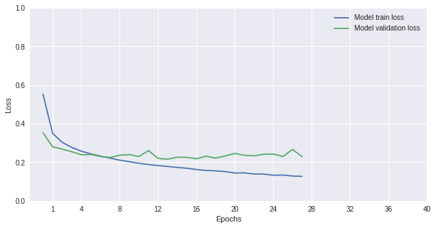
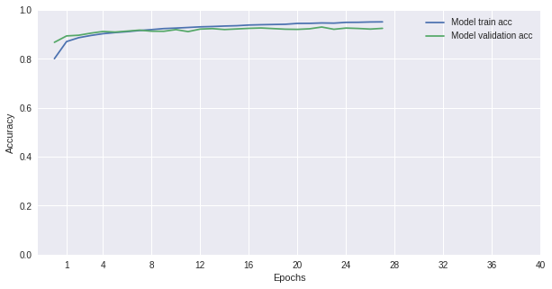
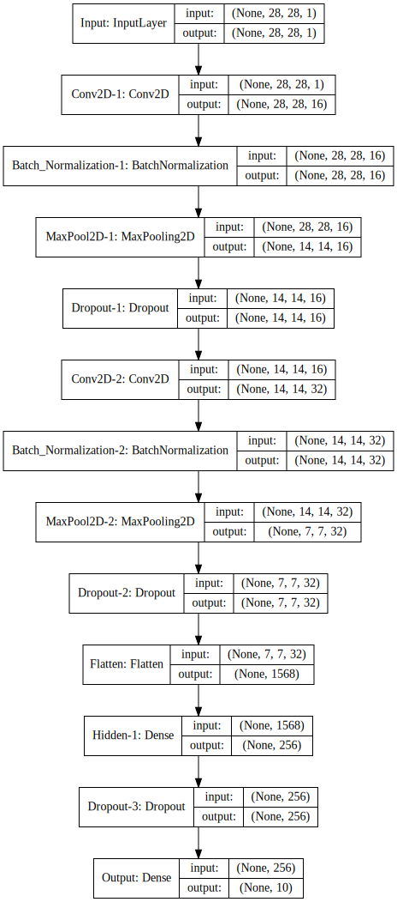
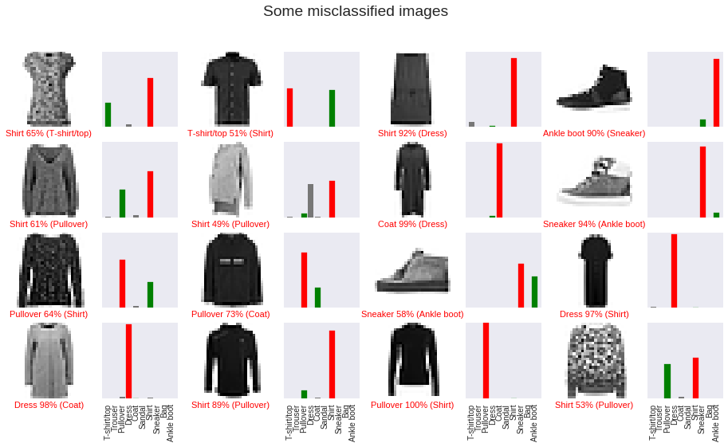

# Deep-Learning-model-for-Fashion-item-recognition
Classification of Fashion-MNIST dataset with tensorflow.keras, using a Convolutional Neural Network (CNN) architecture.
* The dataset contains 70,000 grayscale images in 10 categories.
Label Description:

``
0 T-shirt/top 
1 Trouser 
2 Pullover 
3 Dress 
4 Coat 
5 Sandal 
6 Shirt 
7 Sneaker 
8 Bag 
9 Ankle boot``

* The images show individual articles of clothing at low resolution (28 by 28 pixels).
* 60,000 images to train the network and 10,000 images to test it.
* The shape of each image is 28x28 pixels x1 channel (grey).
* **Data Normalization**: The values of the inputs are in [0, 255] so we normalize them to [0, 1] dividing by 255.

### Data augmentetion

Data augmentation is often used in order to improve generalisation properties. Typically, horizontal flipping,zooming shifts are used. However, in this case data augmentation did not improved the classifier's results.

### The Model 

- We use a Functional Model with following layers:
    
- `Input` layer 
- ` 2D Convolution layer` with 16 filters and [5x5] kernel size.
    - `Batch Normalization`
    - `Max Pooling`
    - `Dropout` 25%
- ` 2D Convolution layer` with 32 filters and [5x5] kernel size.
    - `Batch Normalization`
    - `Max Pooling`
    - `Dropout` 25%
- Then, `Flatten` the convolved images so as to input them to a Dense Layer.
- `Dense Layer` hidden layer with output 1024 nodes.
    - `Dropout` 25%
- `Output Layer`.

To compile the model:
- As optimazer we use `Adam`.
- As loss function we use `categorical_crossentropy` because the targets are categorical one-hot encoded.

To evaluate the model:
- Accuracy on both validation and test set is used.

**In order to find the above model the following strategy is used:**
1. As mentioned above, data augmentetion worsen the classifier's performance; thus, only the original data is used. In case of less data, data augmentetion would be useful.
2. I choose to build a model with `CNNs` because they outerperform the other NN at image classification tasks. Additionally, I built a MLP model with 2 hidden layers, which had 3% less accuracy compared to the CNN model.
    
    - The proper number of CNN layers is defined to two after several trials. In fact, more layers cause overfitting.
    
    - At detector stage of convolutional layers `ReLU` is used as activiation function. Other activiation functions such as ELU was also used but with no better results than Relu.
   
    - At polling stage of convolutional layers `max pooling` was choosen with striding [2,2]. Without striding the model had slightly better accuracy, but way more parameters need to be trained. 
   
    - Each convolution layer has different number of `filters`. In this way, the network will learn more details about the unique characteristics of each class. These, values was defined after trials.
    
    - The `kernel size` was set to [5,5] .
    
    - The `dilation rate` found to not improve model's accuracy. Thus, it was set to [1,1].
    
    - `Striding` was set to [1,1], since the input size of images is already small we do not want to loose any information.
    
    - `Dropout` was set to [0.25], helping the model to avoid overfitting and train faster.
    
    - `Batch normalization` between convolution(linear) and detector stage(non-linear) acts as regularizer, allowing higher learning rates. In this case, Batch normalization helped the model to be trained in fewer epochs and the model had slightly better accuracy. Thus, we used this normalization strategy.
    - `Kernel regularization` was tested without better results on model's accuracy.

3. After the convolutional layers an `MLP` with one hidden layer is used to do the classification job, as MLPs are powerful classifiers.
      
     - `ReLU` used as activiation function.
     - `Dropout` [0.25] was used again at this stage.

4.  As output activiation function we use `softmax`, which is the suggested output activiation function for multi-label classification problems.
5. `EarlyStopping` is used in order to find the proper number of epochs which reduces the generalization error.

### Training and Evaluation
    Epoch 00028: early stopping
    Finished training.
    ------------------
    _________________________________________________________________
    Layer (type)                 Output Shape              Param #   
    =================================================================
    Input (InputLayer)           (None, 28, 28, 1)         0         
    _________________________________________________________________
    Conv2D-1 (Conv2D)            (None, 28, 28, 16)        416       
    _________________________________________________________________
    Batch_Normalization-1 (Batch (None, 28, 28, 16)        112       
    _________________________________________________________________
    MaxPool2D-1 (MaxPooling2D)   (None, 14, 14, 16)        0         
    _________________________________________________________________
    Dropout-1 (Dropout)          (None, 14, 14, 16)        0         
    _________________________________________________________________
    Conv2D-2 (Conv2D)            (None, 14, 14, 32)        12832     
    _________________________________________________________________
    Batch_Normalization-2 (Batch (None, 14, 14, 32)        56        
    _________________________________________________________________
    MaxPool2D-2 (MaxPooling2D)   (None, 7, 7, 32)          0         
    _________________________________________________________________
    Dropout-2 (Dropout)          (None, 7, 7, 32)          0         
    _________________________________________________________________
    Flatten (Flatten)            (None, 1568)              0         
    _________________________________________________________________
    Hidden-1 (Dense)             (None, 256)               401664    
    _________________________________________________________________
    Dropout-3 (Dropout)          (None, 256)               0         
    _________________________________________________________________
    Output (Dense)               (None, 10)                2570      
    =================================================================
    Total params: 417,650
    Trainable params: 417,566
    Non-trainable params: 84
    _________________________________________________________________
    10000/10000 [==============================] - 1s 94us/step

### Model's performance

- This relatively small and easy to be trained CNN model achieved 92.58% accuracy and 25.53% loss on test set (742 out of 10000 images was misclassified). Furthermore, 417,650 parameters was trained in 28 epochs, where the model retains its generalization power.

### Misclassified images

- As it can been seen from the above plots, even a human eye cannot easily discriminate the proper class for each of those images. Thus, this model is performing quite well at fashion recognition.

 [[850   0  19  15   2   1 106   0   7   0]
     [  1 990   0   7   1   0   0   0   1   0]
     [ 15   1 885   6  45   0  48   0   0   0]
     [ 11   4  10 932  22   0  20   0   1   0]
     [  0   1  44  16 889   0  50   0   0   0]
     [  0   0   0   0   0 983   0  10   0   7]
     [ 75   2  50  26  46   0 799   0   2   0]
     [  0   0   0   0   0   5   0 979   0  16]
     [  3   2   0   5   3   0   1   3 981   2]
     [  0   0   0   0   0   3   1  26   0 970]]
                  precision    recall  f1-score   support
    
     T-shirt/top       0.89      0.85      0.87      1000
         Trouser       0.99      0.99      0.99      1000
        Pullover       0.88      0.89      0.88      1000
           Dress       0.93      0.93      0.93      1000
            Coat       0.88      0.89      0.89      1000
          Sandal       0.99      0.98      0.99      1000
           Shirt       0.78      0.80      0.79      1000
         Sneaker       0.96      0.98      0.97      1000
             Bag       0.99      0.98      0.98      1000
      Ankle boot       0.97      0.97      0.97      1000
    
       micro avg       0.93      0.93      0.93     10000
       macro avg       0.93      0.93      0.93     10000
    weighted avg       0.93      0.93      0.93     10000
    
- Finally, the confusion matrix shows that the model classified 'trouser', 'sandal','sneaker', 'bag' and 'ankle boot' classes over 97% correctly but seemed to struggle quite a bit with 'shirt' class (79% accurate), which was regularly confused with 't-shirt/top', 'pullover' and 'coat' classes.

